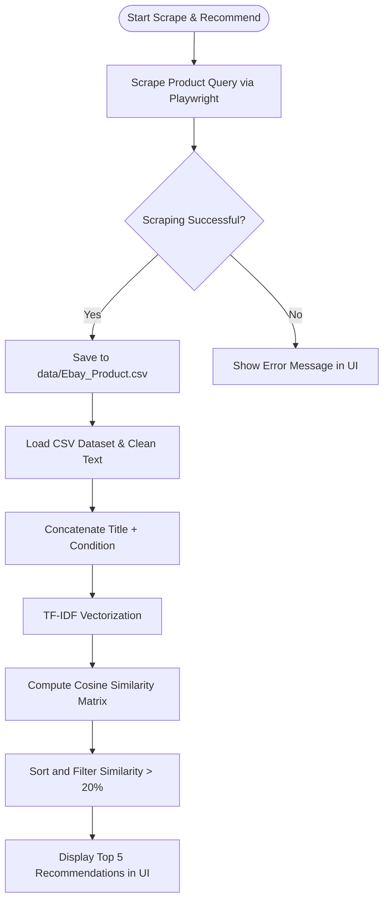
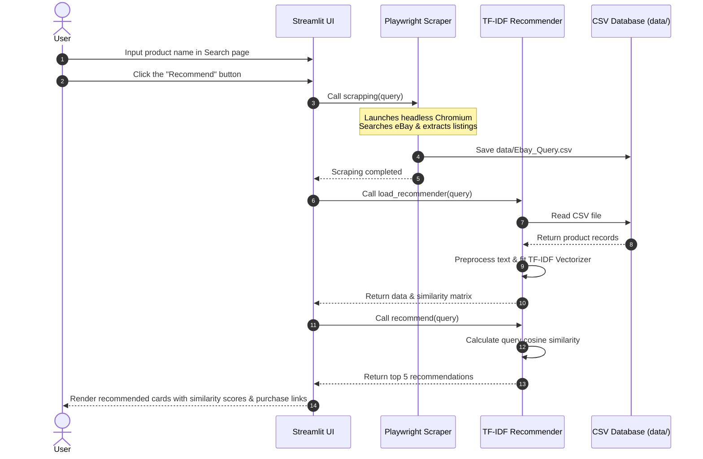

# 🛒 AI Product Recommendation Engine

An intelligent product recommendation system that scrapes live listings from eBay in real-time and uses Machine Learning to recommend similar products. Built using **Streamlit**, **Playwright**, and **scikit-learn**.

---

## 🚀 Features

- **Live eBay Web Scraping**: Scrapes active eBay listings dynamically using Playwright in headless mode (extracting titles, prices, conditions, image URLs, and item page links).
- **Dynamic Similarity Engine**: Cleans textual data and computes Cosine Similarity using TF-IDF (Term Frequency-Inverse Document Frequency) vectors based on product titles and conditions.
- **Interactive UI**: Clean, responsive multi-page dashboard built with Streamlit featuring real-time scraping, live search, recommendation metrics, and direct links to products on eBay.
- **Random Product Mode**: Shows suggestions for random items selected from all previously scraped databases.

---

## 📊 System Architecture & Workflows

### 1. Overall System Workflow

This diagram illustrates how the system transitions from web scraping to processing the data and generating final similarity recommendations:



### 2. User Interaction Flow

This sequence diagram depicts how a user interacts with the Streamlit interface and how the backend components respond to generate recommendations:



---

## 🛠️ Local Installation & Setup Instructions

Follow these step-by-step instructions to get the project running locally on your machine.

### 📋 Prerequisites

Make sure you have python 3.8+ installed on your system.

### ⚙️ Steps

#### 1. Clone or Open the Project
Navigate to the directory containing the project:
```bash
cd "Recommendation Engine"
```

#### 2. Create a Virtual Environment
It is highly recommended to use a virtual environment to manage project dependencies:
- **On Windows**:
  ```powershell
  python -m venv venv
  ```
- **On macOS/Linux**:
  ```bash
  python3 -m venv venv
  ```

#### 3. Activate the Virtual Environment
- **On Windows (PowerShell)**:
  ```powershell
  .\venv\Scripts\Activate.ps1
  ```
- **On Windows (CMD)**:
  ```cmd
  .\venv\Scripts\activate.bat
  ```
- **On macOS/Linux**:
  ```bash
  source venv/bin/activate
  ```

#### 4. Install Dependencies
Install all the required packages listed in `requirements.txt`:
```bash
pip install -r requirements.txt
```

#### 5. Install Playwright Browsers
Since the scraper relies on Playwright to run a headless browser, you need to install the browser binaries:
```bash
playwright install
```

#### 6. Run the App
Launch the Streamlit server to start the web app:
```bash
streamlit run app.py
```

After running this command, the application will automatically open in your default browser at `http://localhost:8501`.

---

## 📁 File Structure

- [app.py](./app.py): The entry point for the Streamlit dashboard layout and navigation state.
- [scraper.py](./scraper.py): Contains the Playwright automation script to search and extract listings from eBay.
- [recommender.py](./recommender.py): Contains the text preprocessing, TF-IDF vectorization, and cosine similarity calculations.
- [random_recommendation.py](./random_recommendation.py): Combines all CSV datasets from `data/` and generates suggestions for random items.
- [data/](./data/): Folder where the scraped listing data is stored in CSV format.
- [requirements.txt](./requirements.txt): List of Python libraries required for this project.
